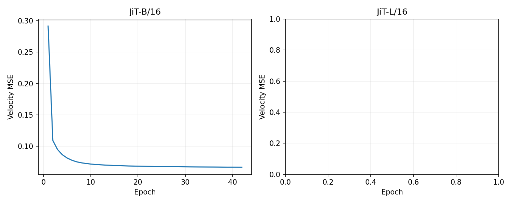

# JiT 官方配置复现实验报告

更新时间：2026-09-26T18:15:47.030795+00:00

## 当前进度

**已完成训练与最终评估：0/2。** 当前展示独立的 4 卡实验。训练轮数取自逐轮日志；检查点每 5 轮保存，异常退出后从检查点恢复：

- JiT-B/16：训练日志已完成 42/200 epochs；可恢复检查点为第 40 轮。

- JiT-L/16：训练日志已完成 0/200 epochs；可恢复检查点为第 0 轮。

JiT-B/16 最近 5 个 epoch 平均 14.6 分钟；剩余训练约 38.3 小时，不含评估、重试和排队。

JiT-B/16 第 40 epoch 中途评估：FID-8000=25.1137，CFG=2.9，EMA=0.9996。这是中途 8K 指标，不能作为最终 FID-50K 结果。

8 卡实验仍使用独立目录 `runs/b16_200ep`、`runs/l16_200ep`；其结果不会与本页的 4 卡实验合并。

GPU smoke：passed，NVIDIA H100 80GB HBM3。

ImageNet 完整数据已校验、解压：1,281,167 images，1000 classes。


Slurm 队列：
```text
101994 jit_b16_l16_4gpu PENDING (Dependency)
101993 jit_b16_l16_4gpu PENDING (Dependency)
101992 jit_b16_l16_4gpu PENDING (Dependency)
101991 jit_b16_l16_4gpu PENDING (Dependency)
101990 jit_b16_l16_4gpu PENDING (Dependency)
101989 jit_b16_l16_4gpu PENDING (Dependency)
101988 jit_b16_l16_4gpu PENDING (Dependency)
101987 jit_b16_l16_4gpu PENDING (Dependency)
101986 jit_b16_l16_4gpu PENDING (Dependency)
101985 jit_b16_l16_4gpu PENDING (Dependency)
101984 jit_b16_l16_4gpu PENDING (Dependency)
101983 jit_b16_l16_4gpu PENDING (Dependency)
101982 jit_b16_l16_4gpu PENDING (Dependency)
101981 jit_b16_l16_4gpu PENDING (Dependency)
101980 jit_b16_l16_4gpu RUNNING alphagpu07
```

流水线记录：2026-09-26：作业 101980 已在 alphagpu07 的 4 张 H100 上恢复训练，并完整跑过此前失败的第 41 轮以及下一轮。实时已完成轮数见本报告的训练日志进度；每 5 轮保存的检查点单独列出。effective batch=1024、LR=2e-4、B/16 CFG=2.9。L/16 将在 B/16 完成后开始。

## 预注册设置

当前按用户要求先训练 JiT-B/16、JiT-L/16；每个模型从头训练 200 epochs，AdamW、实际 LR=2e-4、全局有效 batch=1024、5 epoch warmup、constant LR。4 张卡时 B/16 每卡 batch 128、累积 2 次；L/16 每卡 batch 64、累积 4 次。

固定 CFG 和分辨率：B/16 256² CFG 2.9（官方；另测 issue #56 的 CFG 3.6、EMA 0.9996）；L/16 256² CFG 2.4。CFG interval 均为 [0.1,1.0]，ODE solver 为 50-step Heun。

CFG 取自作者 README 按模型和分辨率给出的训练／评估示例。每个 CFG 固定，不跨值搜索；每个模型只在该 CFG 下用 8K 选择 EMA，再以相同 CFG 和 EMA 计算 FID-50K。

训练超参、批量和累积步数见 [`configs/`](../configs/)。B/L 的 dropout 为 0，P_mean=-0.8、P_std=0.8、t_eps=0.05、label drop=0.1、noise scale=1。4 卡等效设置和数值复现的边界见 [说明](four_gpu_equivalence.md)。


## FID-50K 对照

| 模型 | 分辨率 | 固定 CFG | 200-epoch 论文 FID | 本次 EMA | 本次 FID-50K | 差值 |

|---|---:|---:|---:|---:|---:|---:|

| JiT-B/16 | 256² | 2.9 | 4.37 | — | — | — |

| JiT-L/16 | 256² | 2.4 | 2.79 | — | — | — |





## 复现证据与边界

上游 JiT 与定制 torch-fidelity 使用锁定 submodule；原模型、denoiser、loss 和 attention 保持上游实现。环境锁、GPU smoke 和数据验证记录见本目录。

训练保存 checkpoint、三组 EMA、优化器和各 rank RNG，每 5 epochs 保存一次；本轮执行顺序为 B/16、L/16。

200 epoch 是目标训练预算；FID 使用 1000 类均衡的 50K 样本。8K 只用于选 EMA，不代替正式结果。
