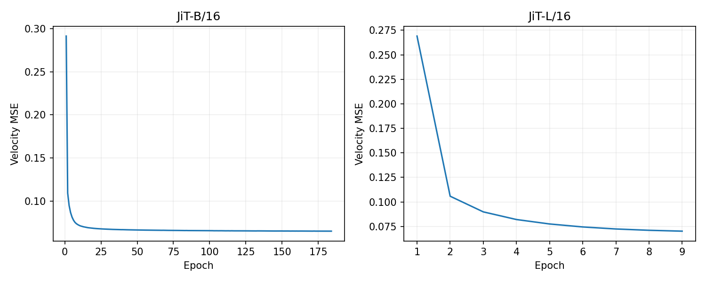

# JiT 官方配置复现实验报告

更新时间：2026-09-28T14:47:06.438121+00:00

## 当前进度

**已完成训练与最终评估：0/2。** 当前展示独立的 4 卡实验。训练轮数取自逐轮日志；检查点每 5 轮保存，异常退出后从检查点恢复：

**当前四卡任务在排队，没有正在运行的四卡训练作业。** 续跑从检查点恢复，尚未保存的日志轮数需要重跑。

自动汇报：每 6 小时在本对话和 GitHub 更新（美东 02:30, 08:30, 14:30, 20:30），状态 `active`；下一次计划时间：2026-09-28T14:30:00-04:00。定时器所在登录主机需保持运行。

- JiT-B/16：训练日志已完成 157/200 epochs；可恢复检查点为第 155 轮。

- JiT-L/16：训练日志已完成 0/200 epochs；可恢复检查点为第 0 轮。

JiT-B/16 最近 5 个 epoch 平均 22.3 分钟；剩余训练约 16.7 小时，不含评估、重试和排队。

JiT-B/16 第 120 epoch 中途评估：FID-8000=9.9013，CFG=2.9，EMA=0.9996。这是中途 8K 指标，不能作为最终 FID-50K 结果。

8 卡实验仍使用独立目录 `runs/b16_200ep`、`runs/l16_200ep`；其结果不会与本页的 4 卡实验合并。

GPU smoke：passed，NVIDIA H100 80GB HBM3。

ImageNet 完整数据已校验、解压：1,281,167 images，1000 classes。


Slurm 队列：
```text
101983 jit_b16_l16_4gpu PENDING (Priority)
101994 jit_b16_l16_4gpu PENDING (Dependency)
101993 jit_b16_l16_4gpu PENDING (Dependency)
101992 jit_b16_l16_4gpu PENDING (Dependency)
101991 jit_b16_l16_4gpu PENDING (Dependency)
101990 jit_b16_l16_4gpu PENDING (Dependency)
101989 jit_b16_l16_4gpu PENDING (Dependency)
101988 jit_b16_l16_4gpu PENDING (Dependency)
101987 jit_b16_l16_4gpu PENDING (Dependency)
101986 jit_b16_l16_4gpu PENDING (Dependency)
101985 jit_b16_l16_4gpu PENDING (Dependency)
101984 jit_b16_l16_4gpu PENDING (Dependency)
```

流水线记录：2026-09-28 10:47 EDT 自动检查：目前没有四卡训练作业运行；续跑作业 101983 正在排队（(Priority)）。 训练历史最大轮数和可恢复检查点分别列出。

## 预注册设置

当前按用户要求先训练 JiT-B/16、JiT-L/16；每个模型从头训练 200 epochs，AdamW、实际 LR=2e-4、全局有效 batch=1024、5 epoch warmup、constant LR。4 张卡时 B/16 每卡 batch 128、累积 2 次；L/16 每卡 batch 64、累积 4 次。

固定 CFG 和分辨率：B/16 256² CFG 2.9（官方；另测 issue #56 的 CFG 3.6、EMA 0.9996）；L/16 256² CFG 2.4。CFG interval 均为 [0.1,1.0]，ODE solver 为 50-step Heun。

固定 CFG 结果沿用作者 README：在该 CFG 下用 8K 选择 EMA，再生成 50K。另按论文 Appendix A 搜索 CFG=1.0–4.0（步长 0.1）与 EMA={0.9996,0.9998,0.9999} 共 93 组，每组 8K；选出最低 FID 对应参数后生成 50K 并计算 FID。固定 CFG 的结果和论文搜索结果分别列出。

训练超参、批量和累积步数见 [`configs/`](../configs/)。B/L 的 dropout 为 0，P_mean=-0.8、P_std=0.8、t_eps=0.05、label drop=0.1、noise scale=1。4 卡等效设置和数值复现的边界见 [说明](four_gpu_equivalence.md)。


## 同 epoch、论文评估流程的 FID-50K 对照

官方基准来自 [论文 Table 6](https://arxiv.org/html/2511.13720v2#S5.T6)，均为 200 epochs、256²、FID-50K。本文 40/80/120/160 epoch 的 8K 监测值不参与该表；论文未提供这些轮数的可直接对照值。

未找到 B/16、L/16 可直接对照的官方 100 epoch FID-50K；100 epoch checkpoint 保留，但正式对照选择论文明确公布的 200 epoch。没有真实 50K 结果时，不判断是否已接近官方。

两边使用 1000 类、每类 50 张生成图片，对 ImageNet 训练集计算 FID。复现使用作者发布的 `jit_in256_stats.npz`、锁定的 torch-fidelity、50-step Heun、CFG interval [0.1,1.0]。评估 JSON 记录统计文件 SHA-256、后端 commit、CFG、EMA、epoch 和 checkpoint 标识。论文数值来自原实现；按公开 PyTorch 代码对齐评估流程，不承诺逐位一致。

| 模型 | epoch（双方） | 分辨率 | 官方 FID-50K | 本次 FID-50K | 本次 CFG / EMA | 差值 |
|---|---:|---:|---:|---:|---|---:|
| JiT-B/16 | 200 | 256² | 4.37 | 待评估 | — | — |
| JiT-L/16 | 200 | 256² | 2.79 | 待评估 | — | — |


### README 固定 CFG 的 FID-50K

此表保留指定 CFG 的结果。论文的最优 EMA/CFG 随训练轮数变化，因此本表不计算论文差值；完整搜索结果见上表。

| 模型 | epoch | 固定 CFG | 选中 EMA | FID-50K |
|---|---:|---:|---:|---:|
| JiT-B/16 | 200 | 2.9 | — | 待评估 |
| JiT-L/16 | 200 | 2.4 | — | 待评估 |





## 复现证据与边界

上游 JiT 与定制 torch-fidelity 使用锁定 submodule；原模型、denoiser、loss 和 attention 保持上游实现。环境锁、GPU smoke 和数据验证记录见本目录。

训练保存 checkpoint、三组 EMA、优化器和各 rank RNG，每 5 epochs 保存一次；本轮执行顺序为 B/16、L/16。

200 epoch 是目标训练预算；FID 使用 1000 类均衡的 50K 样本。8K 用于训练监测和 EMA/CFG 选择，不代替正式结果。

2026-09-27 加入完整论文评估流程；训练脚本在作业启动时加载，排队中的自动续跑任务会读取更新后的版本，在 200 epoch 触发最终评估。

每个 50K 阶段完成后自动生成此报告并尝试提交、推送到 GitHub。单组评估结果可断点复用；推送失败记录在运行目录的 `report_publish.json`，不会中断训练。
